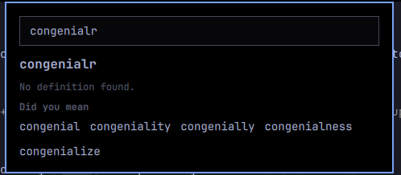

# barun-labs.thesaurus

An Omarchy shell plugin for reading. It adds a book icon to the bar. Highlight
a word on screen, press a keybind, and a panel pops up with the word's
definition, an example sentence, its synonyms, and its antonyms.



If you mistype a word or highlight something that isn't in the dictionary,
the panel offers "did you mean" suggestions instead — click one and it looks
up that word. The panel's text field is always editable too: type a word and
press Enter to look it up directly, without highlighting anything first.
Press Escape to close the panel.

## Data sources and privacy

Synonyms, antonyms, and spelling suggestions come from
[Datamuse](https://www.datamuse.com/api/) (`api.datamuse.com`) — no API key
needed. The definition and example sentence come from the
[Free Dictionary API](https://dictionaryapi.dev/) (`api.dictionaryapi.dev`).

Every word you look up is sent in plaintext to both of those hosts. There is
no local dictionary or offline fallback in this phase — if you're offline,
lookups simply fail.

## Requirements

- The Omarchy Quickshell shell.
- `curl`, `jq`, and `wl-paste` (from `wl-clipboard`) on your `PATH`.

Nothing else. There's no separate service process and no build step.

## Install

The plugin lives at `~/.config/omarchy/plugins/barun-labs.thesaurus/`. Once
it's there, enable it with:

```
omarchy plugin enable barun-labs.thesaurus right
```

Or install it directly from the repository instead of placing the files by
hand:

```
omarchy plugin add https://github.com/barun-labs/omarchy-plugin-thesaurus.git --enable
```

## Explain and Transform

Beyond the dictionary lookup, the panel can call DeepSeek to explain slang,
foreign words, or whole phrases the dictionary won't have an entry for. Click
"Explain" in the panel, or highlight text and use a keybind (see below) to
explain it directly. "Transform" offers formalize, simplify, use-in-sentence,
and translate, each rewriting the current word or phrase in place.

This needs a DeepSeek API key at `~/.config/deepseek/thesaurus-key`:

```
mkdir -p ~/.config/deepseek
echo "sk-..." > ~/.config/deepseek/thesaurus-key
chmod 600 ~/.config/deepseek/thesaurus-key
```

Without a key, Explain and Transform show a message instead of a result — the
dictionary lookup (definition, synonyms, antonyms) still works normally, no
key required.

The model is `deepseek-chat`, and both the model and the transform's target
translation language are constants at the top of `llm.sh`, so retargeting
either is a one-line edit.

To bind a key that explains whatever's highlighted without opening the panel
manually first, add something like this to your Hyprland config:

```
# Omarchy keybind (user config) — highlight, then this key explains it:
bind = SUPER, e, global, quickshell:barun-labs.thesaurus:explainSelection
```

## Keybind

The plugin doesn't bind a key on its own — you add one. Open
`~/.config/hypr/bindings.lua` and add:

```lua
o.bind("SUPER + SHIFT + D", "Define word", "omarchy-shell shell toggle barun-labs.thesaurus")
```

The modifier string needs a `+` between every modifier, including the last
one before the key: `SUPER + SHIFT + D`. Hyprland's own bind list displays
this same shortcut as `SUPER SHIFT + D` (no `+` before the final modifier),
but that display form will not parse if you type it into `bindings.lua`
yourself — write it with a `+` everywhere.

After saving, reload Hyprland's config:

```
hyprctl reload
```

You can also just click the book icon in the bar; the keybind is a shortcut
to the same toggle, not a requirement.

## Editing the plugin

If you change any of the plugin's `.qml` files, the shell's normal file-watch
reload will not pick it up correctly: once a widget has failed to load once,
the watcher caches that failure and won't recompile it even after you fix the
file. Run a full restart instead:

```
omarchy restart shell
```

## Remove

```
omarchy plugin remove barun-labs.thesaurus
```

## Privacy note for Explain and Transform

Unlike the dictionary lookup, Explain and Transform send the highlighted text
(or whatever's in the query field) to DeepSeek's API over HTTPS, using your
own key. Nothing is sent unless you trigger Explain or Transform — the plain
dictionary lookup never touches DeepSeek.
